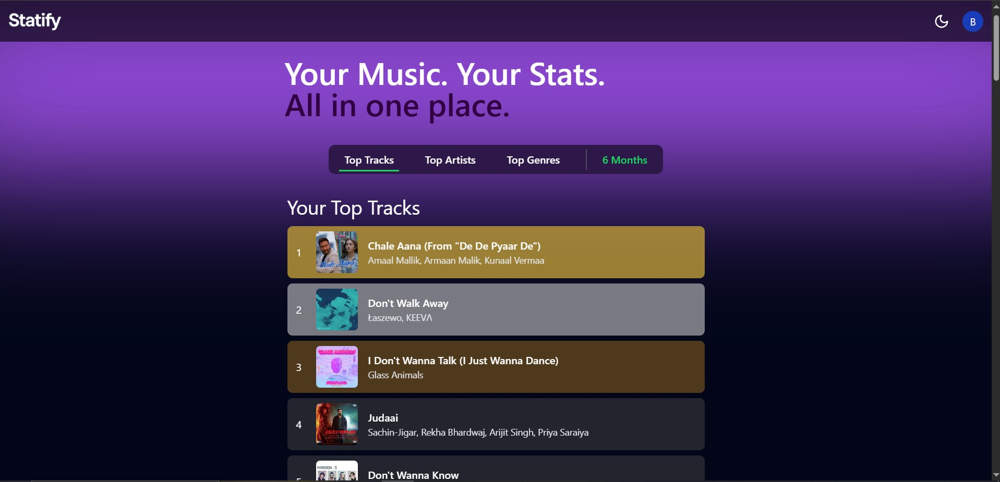

# 🎵 Statify – Your Spotify Listening Insights

Statify is a web app that connects to your Spotify account and shows your **top tracks**, **top artists**, and other listening stats in a clean, responsive interface.

 <!-- optional -->

---

## 🚀 Features

- **Spotify Login** – Secure authentication using Spotify OAuth 2.0.
- **Top Artists & Tracks** – View your most listened-to artists and songs.
- **Time Ranges** – Filter stats by last month, 6 months, or all time.
- **Dynamic Refresh** – Automatically refreshes expired access tokens.
- **Privacy-Friendly** – No permanent storage of your Spotify data.
- **Fast Loading** – Optional Redis caching for faster retrieval.

---

## Try it for yourself

- Visit https://statify-wine.vercel.app

## 🛠 Tech Stack

- **Frontend:** Next.js 14 (App Router), TypeScript, Tailwind CSS
- **Backend:** Next.js API Routes, Node.js
- **Auth:** Spotify OAuth 2.0
- **API:** Spotify Web API
- **Caching (Optional):** Redis

---

## 📦 Installation

1. **Clone the repository**
   ```bash
   git clone https://github.com/Rohan-756/Statify.git
   cd Statify
Install dependencies

bash
Copy
Edit
npm install
Set up environment variables
Create a .env.local file and add:

env
Copy
Edit
SPOTIFY_CLIENT_ID=your_spotify_client_id
SPOTIFY_CLIENT_SECRET=your_spotify_client_secret
NEXT_PUBLIC_BASE_URL=http://localhost:3000
Run the development server

bash
Copy
Edit
npm run dev
Visit: http://localhost:3000

## 🔑 Spotify API Setup
Go to the Spotify Developer Dashboard.

Create a new application.

Add your Redirect URI:

bash
Copy
Edit
http://localhost:3000/api/auth/callback
Copy your Client ID and Client Secret into .env.local.


## 📄 License
This project is licensed under the MIT License – see the LICENSE file for details.
